「X（旧 Twitter）のポストやいいねを自動的に Notion に保存する仕組み」を作ったので備忘も兼ねて紹介します。

# リポジトリと使い方

リポジトリは以下です。  
使い方は README.md を確認してください。

https://github.com/shun91/ifttt-to-notion

# Notion に保存するメリット

個人的に一番大きいのは「検索しやすいこと」だと思っています。

X（旧 Twitter）に検索機能もありますが、少し複雑なことをしようと思うと直感的に操作できなかったり、ソートできなかったりするんですよね。。  
Notion なら、これらを解決してくれます。

また、Notion の View という仕組みが地味に便利です。  
例えば「#積読」というテキストが含まれるポストだけを一覧表示する View を作成することができます。


# 仕組み

IFTTT から Google Cloud Functions（GCF） 経由で Notion API を叩いています。

1. 関数の実行： ポストやいいねをすると、IFTTT が Google Cloud Functions をトリガーし、関数が実行されます。
2. データの保存： 実行された関数が Notion API を叩き、ポストやいいねの内容が Notion に保存されます。

```mermaid
graph TD
    A["X (Twitter)"] -->|Trigger| B[IFTTT]
    B -->|Call| C[Google Cloud Functions]
    C -->|API Request| D[Notion]
    style A fill:#1DA1F2,stroke:#333,stroke-width:2px
    style B fill:#FF4400,stroke:#333,stroke-width:2px
    style C fill:#4285F4,stroke:#333,stroke-width:2px
    style D fill:#3F3F3F,stroke:#333,stroke-width:2px
```



割とシンプルなので、技術的な面白みはあまりないかもしれません。

一点工夫した点としては、ポスト本文を Notion Database の title に入れるようにしたことがあります。  
Notion では検索の範囲が title に限定されるため、こうしておかないとポストの全文検索が難しくなるようでした。

# つまづいた点

GCF を触るのは久しぶりだし、Notion API を触るのは始めてだったので、初歩的なところでたくさんつまづきました。。  
今後の誰かのためになるかもしれないので、書き出しておこうと思います。

## GCF の関数をローカル実行する方法がわからない

公式ドキュメントの通りにできました。

https://cloud.google.com/functions/docs/running/function-frameworks?hl=ja

## GCF の関数を GitHub Actions でデプロイする方法がわからない

GitHub Actions が公式で提供されているので、まずはこれを試してみました。

https://github.com/google-github-actions/deploy-cloud-functions

途中、Workload Identity Pool の作成などが必要なのですが、以下の記事の通りにできました。

https://blog.shgnkn.io/github-actions-deploy-google-cloud-functions/

ところで、GCF には 2 つの世代があります。  
試している過程で、こちらの方法では第 1 世代にしか対応していないことが判明しました。

どうせなら最新の第 2 世代を使いたかったので方法を調べたのですが、どうやら GitHub Actions 内で gcloud コマンドを直接叩いてデプロイする必要があるようです。

https://github.com/google-github-actions/deploy-cloud-functions/issues/304#issuecomment-1340062138

上記の issue を読み進めると、setup-gcloud を使った GitHub Actions の例がありました。  
setup-gcloud とは、GitHub Actions 内で gcloud コマンドを簡単に叩けるようにするためのものです。

https://github.com/google-github-actions/deploy-cloud-functions/issues/304#issuecomment-1476629207

こちらを拝借することで、GCF の関数を GitHub Actions でデプロイできました。
ただし、デプロイする成果物のディレクトリ（`dist`など）が`.gitignore`に記載されている場合は、以下を参考にして`.gcloudignore`に`!dist`という 1 行を追加しておく必要があります。

https://github.com/GoogleCloudPlatform/functions-framework-nodejs/issues/303#issuecomment-889988444

### 余談：第 1 世代だと課金される

ちなみに最初は第 1 世代を使っていたのですが、突然 Google からメールが来まして、料金が発生していることが判明しました。

料金明細を見ると、Cloud Storage に課金されていたようです。  
公式ドキュメントにも、第 1 世代だとわずかに費用がかかりそうな記述が。。。

https://cloud.google.com/functions/pricing?hl=ja#deployment_costs

第 2 世代にしてからはほぼ料金は発生しなくなりました。  
「ほぼ」と言ってるのは、実は相変わらず月 1 円だけ料金が発生しています。が、これくらいならまあいっかと放置しています。

## デフォルトでかかってる認証を外す方法がわからない

デプロイされた GCF の関数はデフォルトで認証がかかっています。  
IFTTT から叩くには認証を外す必要があります。セキュリティ的には問題ありなのですが。。。

認証を外すには、gcloud コマンドでのデプロイ時に`--allow-unauthenticated`というオプションを付与します。  
早速試したところ、以下のようなエラーが発生しました。

```
ERROR: (gcloud.functions.deploy) ResponseError: status=[403], code=[Ok], message=[Permission 'run.services.setIamPolicy' denied on resource 'projects/<project_name>/locations/<location>/services/<service_name>' (or resource may not exist).]
```

どうやら、`run.services.setIamPolicy`という権限が必要で、その権限を付与するには Cloud Run 管理者のロールを与えないといけないようでした。

https://cloud.google.com/run/docs/securing/managing-access?hl=ja

[IAM](https://console.cloud.google.com/iam-admin/iam)から上記の権限を付与し、再度デプロイを実行するとうまくいきました。

## 環境変数の設定方法がわからない

Notion の API Key などを環境変数に設定したかったのですが、正攻法としては[Secret Manager](https://cloud.google.com/secret-manager?hl=ja)を使うべきだということが分かりました。  
ですが、面倒くさがりな自分はもっと簡易な方法で済ませたいと思い、以下のようにしました。

1. GitHub Actions の secret に環境変数を登録
2. gcloud コマンドによるデプロイ時`--set-env-vars`オプションを使い環境変数を設定する

```bash
gcloud functions deploy iftttToNotion --set-env-vars="ACCESS_TOKEN=${{ secrets.ACCESS_TOKEN }},NOTION_API_KEY=${{ secrets.NOTION_API_KEY }}"
```

※説明に不要なオプションは省略しています

# おわりに

もっと早く記事にしたかったのに、気づいたら 3 ヶ月も経ってた...
